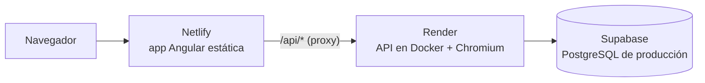

# Despliegue



- **Netlify** sirve el frontend y reenvía `/api/*` a Render. Para el navegador, la app y la API están en el mismo dominio, así que las cookies de sesión (`SameSite=Strict`) funcionan sin cambios.
- **Render** ejecuta la API con el `Dockerfile` de `backend/`, que incluye el Chromium para los PDF.
- **Supabase**: usa un proyecto **distinto** del de desarrollo.

Los archivos de configuración ya están en el repositorio: [`render.yaml`](../render.yaml), [`netlify.toml`](../netlify.toml) y [`backend/Dockerfile`](../backend/Dockerfile).

## 1. Base de datos de producción (Supabase)

1. Crea un proyecto nuevo en Supabase, en la región **East US (North Virginia)**, la misma que el backend.
2. En **Project Settings → Database → Connection string** copia las cadenas del *pooler*:
   - **Transaction** (puerto `6543`): será el `DATABASE_URL` de Render.
   - **Session** (puerto `5432`): solo para aplicar las migraciones desde tu equipo.
3. Aplica las migraciones desde `backend/`. La variable que exportas tiene prioridad sobre tu `.env` de desarrollo:

   ```bash
   cd backend
   DIRECT_URL="postgresql://postgres.<ref>:<password>@aws-0-us-east-1.pooler.supabase.com:5432/postgres" npx prisma migrate deploy
   ```

   En PowerShell:

   ```powershell
   cd backend
   $env:DIRECT_URL = "postgresql://postgres.<ref>:<password>@aws-0-us-east-1.pooler.supabase.com:5432/postgres"
   npx prisma migrate deploy
   Remove-Item Env:DIRECT_URL
   ```

Las migraciones activan RLS en todas las tablas, así que la API REST pública de Supabase no expone datos.

## 2. API en Render

1. En Render: **New → Blueprint**, conecta tu cuenta de GitHub y elige este repositorio. Render detecta `render.yaml`.
2. Rellena las dos variables que pide:
   - `DATABASE_URL`: la cadena **Transaction** (puerto `6543`) de Supabase.
   - `CORS_ORIGIN`: la URL que tendrá el sitio de Netlify. Si aún no la sabes, pon `https://generador-de-cv.netlify.app` y la corriges en el paso 3.

   Los secretos JWT los genera Render automáticamente y el resto de variables ya vienen en el Blueprint.
3. Espera a que termine el primer despliegue (varios minutos, porque descarga Chromium) y comprueba la salud de la API:

   ```bash
   curl https://generador-de-cv-api.onrender.com/api/health
   ```

   Debe responder `{"status":"ok"}`. Si Render asignó otra URL, porque el nombre ya existía, cambia el host del primer `redirect` de `netlify.toml`.

## 3. Frontend en Netlify

1. En Netlify: **Add new site → Import an existing project → GitHub** y elige este repositorio. `netlify.toml` ya define el directorio base, el comando de build y la carpeta publicada; no cambies nada.
2. Cuando termine el despliegue, copia la URL del sitio. Puedes cambiar el nombre en **Site configuration → Change site name**.
3. En Render, pon esa URL exacta en `CORS_ORIGIN` y guarda; Render vuelve a desplegar.

## 4. Comprobación

Abre el sitio de Netlify, crea una cuenta, crea un CV y descarga el PDF.

## Actualizaciones

- Cada push a `master` vuelve a desplegar Netlify y Render automáticamente.
- **Migraciones nuevas**: aplícalas (paso 1.3) **antes** de subir el código que las necesita.

## Variables de la API

| Variable | Producción | Descripción |
|---|---|---|
| `DATABASE_URL` | Supabase, pooler en modo transacción | Conexión de la API |
| `CORS_ORIGIN` | URL de Netlify | Origen permitido |
| `JWT_ACCESS_SECRET` / `JWT_REFRESH_SECRET` | Generados por Render | Distintos entre sí, ≥ 32 caracteres |
| `TRUST_PROXY` | `2` | Proxies delante de la API (Netlify y Render), para que el límite de peticiones use la IP real |
| `PDF_MAX_CONCURRENT` | `1` | PDFs generados a la vez; súbelo si la instancia tiene más memoria |
| `PDF_DISABLE_SANDBOX` | `true` | Render no permite el sandbox de Chromium; la página ya se ejecuta sin JavaScript ni red |
| `PORT` | Lo define Render | |

## Limitaciones del plan gratuito

- **Render Free se duerme tras 15 minutos sin uso** y tarda alrededor de un minuto en despertar. Netlify corta las peticiones de proxy a los ~26 s, así que la primera petición tras una pausa puede fallar: basta con recargar pasado un minuto. El plan **Starter** de Render no se duerme.
- **CPU y memoria limitadas** (512 MB): la primera generación de PDF tras despertar tarda varios segundos más, porque arranca Chromium. Si los PDF fallan por falta de memoria o por el tiempo máximo de 20 s, sube de plan.
